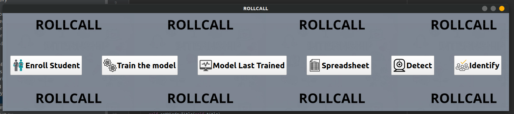

# Automatic-attendance-management-system (ROLLCALL)

## Hey Coder :👋 

Attendance is an important part of our education system. Especially in schools in rural areas where the government uses these attendances for their schemes which they introduce to promote education. The daily attendance of the student is used for the ordering of mid-day meals by the government. But any malpractice related to marking the attendance of students results in individuals making a profit at the cost of the future of India. On top of that, the food wastage that happens because of this is problematic. There have been numerous reports regarding the malpractice in attendance of the students.

ROLLCALL an automatic and smart attendance marking and management system which uses Microsoft Azure’s Cognitive service at its core to create a system that could make sure that no human intervention is required and provides the government the ability to monitor the attendance of the schools and helps the government officials in mark fake schools.

Project

### Why this project ?

* To automate the traditional attendance marking process
* To help government officials keep track of education structure
* To create a better learning environment and improve the education system 

### Functionalities 

 * Student enrolment
 * Image pre-processing and noise removal
 * Model training
 * Face Detection
 * Database Creation For Attendance
 * Final Report Generation

## USP 

* We provide a system which captures attendance of the whole class in one click 
* To maintain accuracy we capture faces for 5 times in one hour class without any involvement 
* Using Microsoft Azure services for maintaining accuracy 

## Hardware used 

1. Raspberry pi
2. Raspberry pi camera V2
3. Powerbank ( optional - for electricity issue )

## Software used

				

